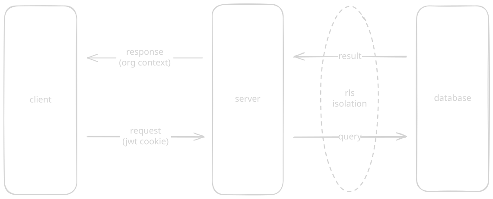
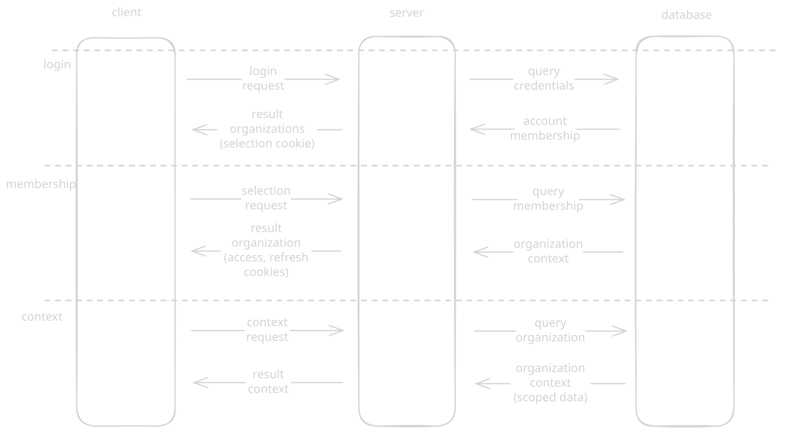

# Secure authorization system

An authorization REST API server featuring RLS database queries, JWT cookies and RBAC. The client implementation includes server-side rendering and navigation guards. Made as a college project.

## About

### Architecture

### Features

Login flow

## Development

use devcontainer

api - localhost 3000

cargo run

app - localhost 3001

npm install
npm run dev

port forwarding

## deployment

cargo build

npm run build

releases

compose

# API

rust, axum, diesel

todo

register, email, totp, mfa

rbac resource check

refresh token flow
refresh token revocation

# APP

typescript, nodejs, nuxtjs

## Contributing

TODO

## License

Look at [LICENSE]()
